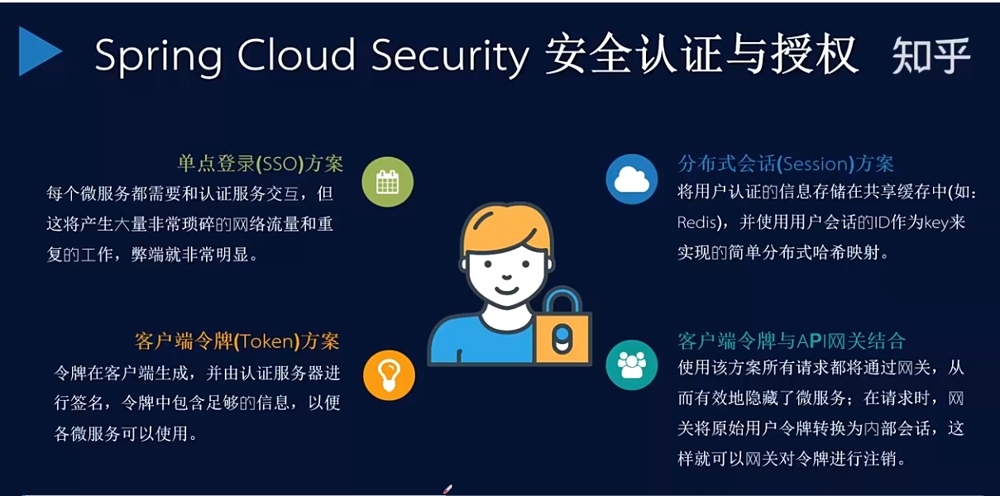

#auth-server 用户管理和认证授权服务

####支持四种授权方式：
* 授权码模式（authorization code）
* 简化模式（implicit）
* 密码模式（resource owner password credentials）
* 客户端模式（client credentials）

#### 实现流程
1. 登录授权返回jwt，关键配置AuthorizationServerConfig
   * 指定授权码存储方案为数据库存储JdbcAuthorizationCodeServices。默认存储在内存中。，也可以自定义存储方式，继承RandomValueAuthorizationCodeServices即可。
   * 指定令牌管理服务，tokenService()
   * 指定token转换器 jwtAccessTokenConverter()
   * token添加额外信息 JwtTokenEnhancer
2. gateway全局过滤器，解析header中jwt鉴权。
3. 资源服务通过解析jwt，调用auth-server获取用户认证用户信息 ，配置项：security.oauth2.resource.user-info-uri

